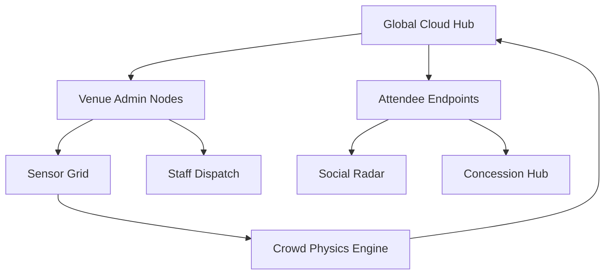

  # 🌊 FlowState

  ### **Predictive Crowd Physics & Unified Venue Intelligence**
  
  [**Visit Website**](https://Rahul-panda564.github.io/FlowState/)
  [](https://reactjs.org/)
  [](https://firebase.google.com/)
  [](https://vitejs.dev/)
  []()
</div>

---

**FlowState** is a high-fidelity, multi-tenant predictive intelligence platform engineered for mission-critical crowd management. Built with a "Mission Control" aesthetic, it bridges the gap between stadium operations, fan engagement, and real-time security telemetry.

## 🎯 Chosen Vertical
**Smart Infrastructure & Public Safety**: FlowState is designed as a mission-critical platform for large-scale venue management, specifically targeting the **Indian Smart Stadium Initiative**.

## 🛰️ Ecosystem Segments

### 🏢 **Venue Command Center**
The operational heartbeat. Monitor gate loads, sensor health, and automated staff dispatching in a glassmorphic intelligence suite.
<div align="center">
  
  <br/>
  
</div>

### 🌍 **Global Intelligence Hub**
Multi-venue management at scale. Super Administrators oversee regional clusters, global telemetry, and fleet-wide system configurations.

### 🧍‍♂️ **Stadium Connect (Fan Terminal)**
A mobile-first attendee experience optimized for the Indian market. Includes real-time concession wait times (INR localized), friend radar, and interactive stadium navigation.
<div align="center">
  
  
</div>

---

## 🏗️ Architecture & Logic



### 1. **Predictive Crowd Physics**
FlowState doesn't just monitor; it predicts. By analyzing gate-arrival intervals and bathroom sensor telemetry, the system forecasts congestion thresholds *before* they occur.

### 2. **Localized Intelligence**
Designed for the **Indian Smart Stadium Initiative**, FlowState features full **INR (₹)** localization, Indian context-aware concession menus, and regional staff management defaults.

### 3. **Role-Based Access Control (RBAC)**
Strict isolation ensures the right personnel see the right data:
- **Commanders**: Deep operational data and sandbox simulations.
- **Security**: Evacuation overrides and incident logs.
- **Fans**: High-level convenience metrics and social features.

---

## 🧠 Assumptions
- **Telemetry Hardware**: Assumes an existing grid of IoT devices (LiDAR, Bluetooth Beacons, and Gate Counters) capable of sending JSON-formatted crowd metrics.
- **Connectivity**: Assumes high-bandwidth stadium Wi-Fi or 5G for the Fan Terminal to receive localized updates.
- **Authentication**: Assumes users have valid credentials or authorization for the secure Google/Firebase backend.

---

## 🎨 Design Philosophy
FlowState utilizes a high-fidelity **Mission Control Design System**:
- **Glassmorphism**: Backdrop-filters and transluscent panels for optimal layering.
- **Motion Logic**: Framer Motion powered transitions for "organic" data updates.
- **Auth Hardening**: Dual-portal entry (Operator/Admin vs. Fan) with simulation bypasses for recruiters.

---

## 🚀 Deployment Guide

### Quick Start (Development)

```bash
# 1. Access the Frontend Repository
cd FlowState/frontend

# 2. Install Dependencies
npm install

# 3. Launch the Intelligence Matrix
npm run dev
```

### Backend Setup
```bash
cd FlowState/backend
npm install
npm start
```

### Credentials (Demo Access)
For evaluators, utilize the **DEMO_TOOLKIT** on the login page for one-click access:
- **Admin**: `admin@gmail.com` / `flowstate123`
- **Fan**: Open via the **Demo Fan Explorer** on the signup portal.

---

## 🛠️ Technology Stack
- **Frontend**: React 18, Vite, Framer Motion
- **Styling**: Vanilla CSS (High-Control Design Tokens)
- **Auth**: Firebase Authentication (GCP)
- **Data**: Real-time Mock Telemetry (Transitionable to WebSocket)

---

## 🚀 Deployment Strategy

FlowState is architected for modern cloud environments:

### **Frontend (Vite/React)**
- **GitHub Pages**: Currently hosted under the `/FlowState/` subfolder.
- **Vercel/Netlify**: Configuration files (`vercel.json`, `netlify.toml`) are provided in the `frontend/` directory for zero-config SPA hosting.

### **Backend (Node.js/Express)**
- **Google Cloud Run**: A production `Dockerfile` is included in the `backend/` directory. This is the recommended platform for high-scale venue operations.
- **Render/Railway**: Connect the directory to automatically deploy via the provided Docker instructions.

### **Database**
- **MongoDB Atlas**: Use the free shared tier for fully managed, secure operational data.

---

<div align="center">
  <sub>Built with Precision by the FlowState Engineering Team</sub>
</div>
